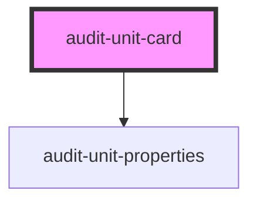

# my-component

<!-- Auto Generated Below -->

## Properties

| Property       | Attribute       | Description | Type     | Default     |
| -------------- | --------------- | ----------- | -------- | ----------- |
| `engagementId` | `engagement-id` |             | `string` | `undefined` |

## Dependencies

### Depends on

- [audit-unit-properties](../audit-unit-properties)

### Graph

----------------------------------------------

*Built with [StencilJS](https://stenciljs.com/)*
