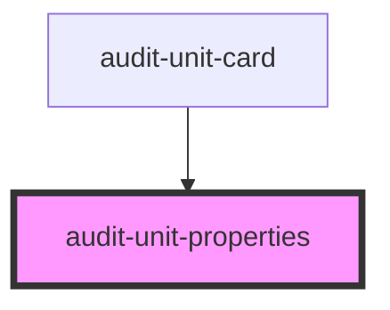

# audit-unit-properties

<!-- Auto Generated Below -->

## Properties

| Property   | Attribute  | Description | Type      | Default     |
| ---------- | ---------- | ----------- | --------- | ----------- |
| `date`     | `date`     |             | `string`  | `undefined` |
| `name`     | `name`     |             | `string`  | `undefined` |
| `open`     | `open`     |             | `boolean` | `false`     |
| `parentid` | `parentid` |             | `string`  | `undefined` |

## Dependencies

### Used by

 - [audit-unit-card](../audit-unit-card)

### Graph

----------------------------------------------

*Built with [StencilJS](https://stenciljs.com/)*
